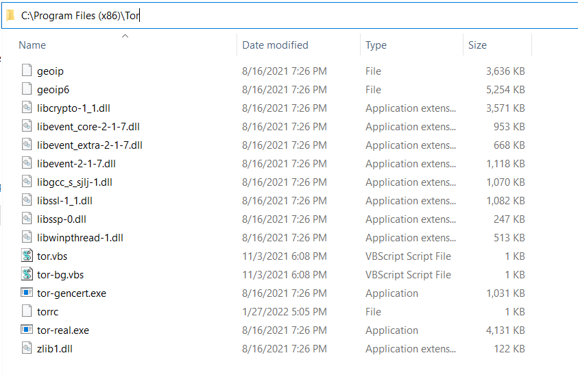
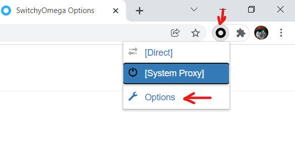
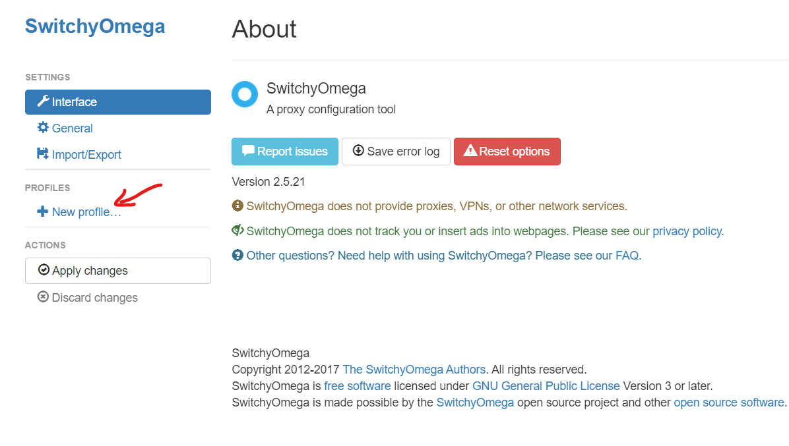
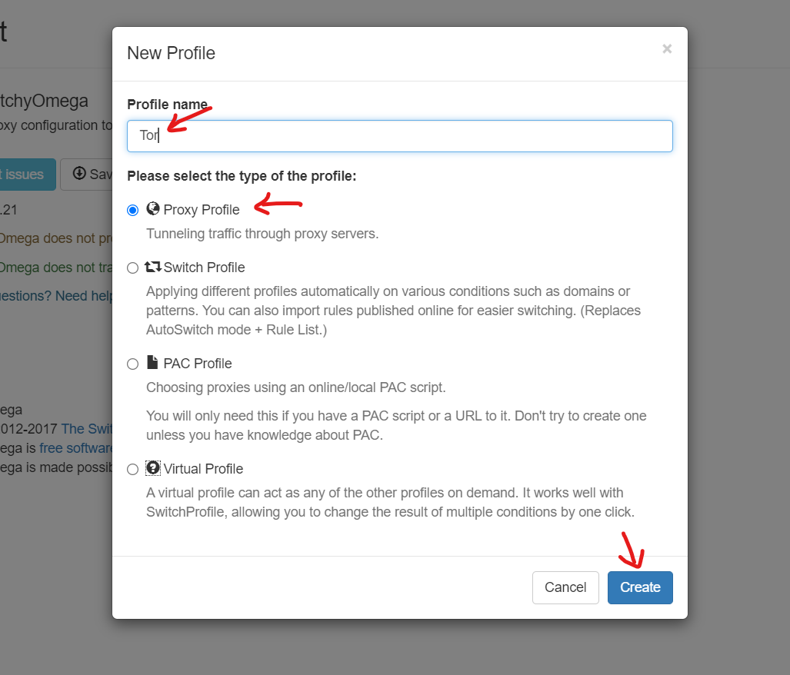
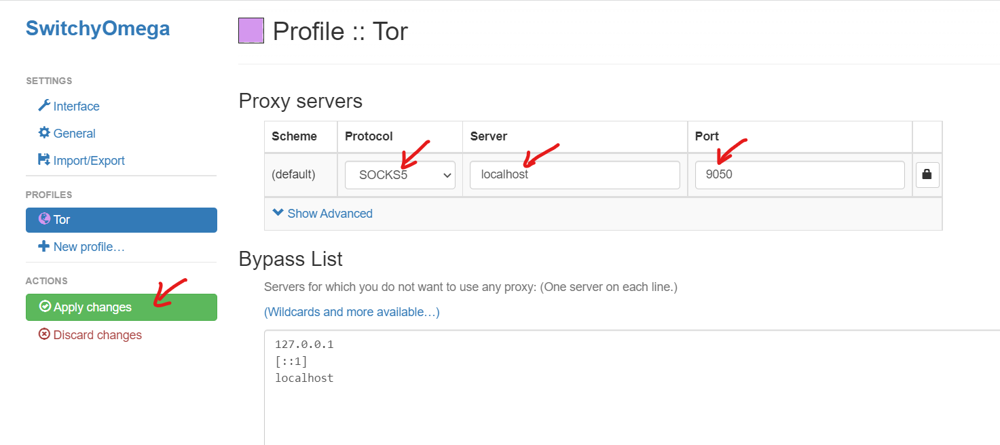
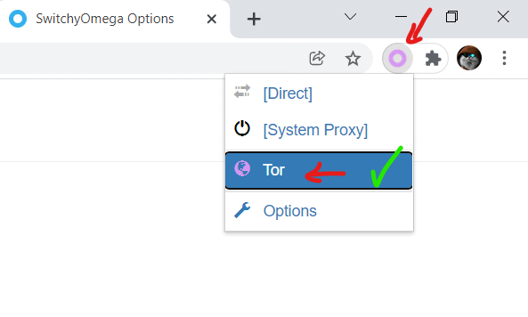

# Tor for Windows

This is Tor expert bundle for windows

## Port numbers

This repository is a configured Tor binaries without any browser. Just a socks v5 proxy on port `9050` (default tor port).

## Installation

Download zip file from [releases](https://github.com/matinrco/tor/releases/latest) and extract it to `C:\Program Files (x86)\Tor` .You can add this directory to windows path to access it via command line.

<details>
<summary>Click here to view in details</summary>



</details>

## Tor cache directory

It's default path: `%APPDATA%\tor` .

## How to use

-   Start Tor:

    -   Manual start:

        Run `tor.vbs` (just double click on it :D ).

    -   Run on windows startup:

        to start Tor on windows startup, put a shortcut of `tor-bg.vbs` into windows startup folder (system wide or user level):

        -   system wide:

            ```
            C:\ProgramData\Microsoft\Windows\Start Menu\Programs\StartUp
            ```

        -   or user level:

            ```
            %APPDATA%\Microsoft\Windows\Start Menu\Programs\Startup
            ```

-   Use it in browser:

    Install `Proxy SwitchyOmega` in [chrome](https://chrome.google.com/webstore/detail/proxy-switchyomega/padekgcemlokbadohgkifijomclgjgif) or [firefox](https://addons.mozilla.org/en-GB/firefox/addon/switchyomega/) to use tor proxy.

    <details>
    <summary>Click here to view in details</summary>

    

    

    

    

    
    </details>

## Compatibility

Tested on windows 10 x64 21h2
